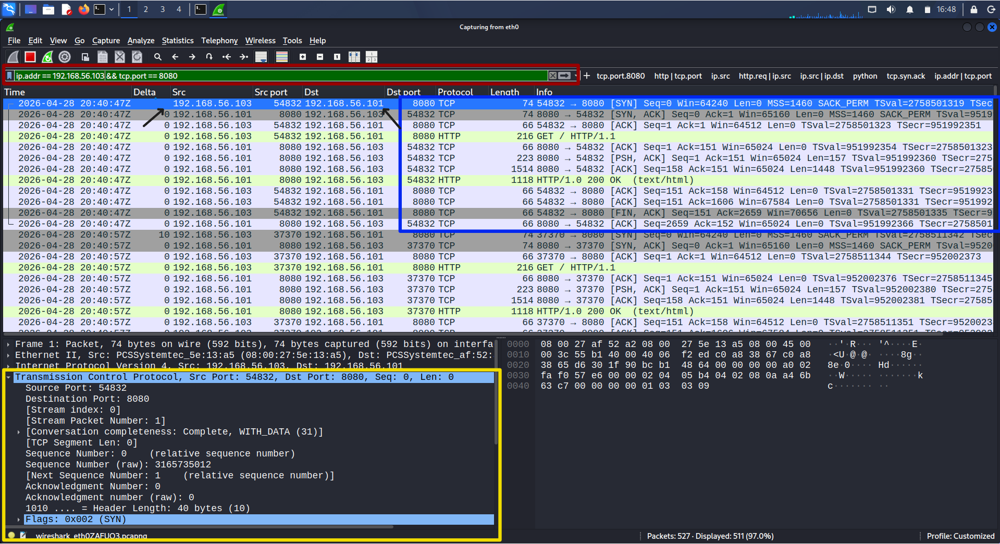
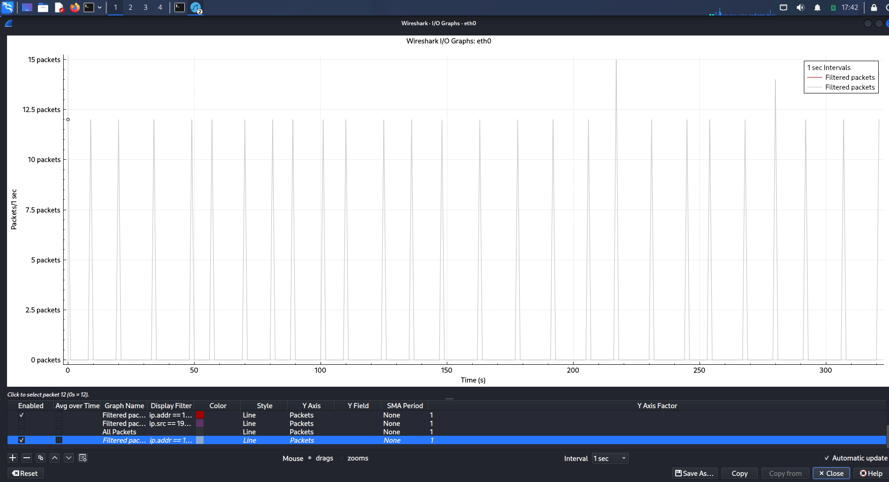

# Detecting Command-and-Control (C2) Beaconing Using Wireshark

## 1. Project Overview

This project demonstrates how Wireshark can be used to detect and analyze network traffic indicative of command-and-control (C2) beaconing. (C2) beaconing is a technique used by malware to communicate with an external server at regular intervals to maintain control, recieve commands, or exfiltrate data while evading detection. The objective is to simulate realistic attacker communication using HTTP and identify suspicious behavioral patterns through packet analysis.

A controlled environment was created where a host repeatedly communicated with an external system over port 8080. Using Wireshark, this traffic was captured, filtered, and analyzed to identify indicators of compromise such as periodic communication, repeated sessions, and application-layer activity. This project provides insight into how SOC and IR teams support detection and investigation. 

---

## 2. Project Relevance 
Wireshark is a widely used open source network protocol analyzer that plays a critical role in the Detection and Analysis phases of the Incident Response (IR) lifecycle. Wireshark plays a critical role in modern incident response, where the priority is no longer just about identifying malware, but also about understanding attacker behavior. 

#### Why Wireshark is Important in IR: 
- Provides deep packet-level visibility into network communications  
- Enables analysts to validate suspicious activity  
- Helps identify command-and-control behavior, data exfiltration, and anomalies  
- Supports rapid triage during security incidents
  - MTTI (mean time to identify): time between the start of SOC triage and the moment an incident handler confirms that the events and alert(s) constitute an incident
- Analyzing network traffic for indicators of attack (i.e., beaconing) 

#### When/How Wireshark is Used: 
- Validation after receving initial alerts 
- During network traffic investigations 
- To support timeline reconstruction 

#### Skills Learned: 
- Packet analysis, filtering, custom profile configuration, exporting objects 
- Identifying behavioral indicators of compromise 
- Mapping technical findings to real-world attacker techniques (MITRE ATT&CK)

In this C2 beaconing simulation, Wireshark provided detailed visibility into network activity by allowing us to analyze packet-level communication between systems. It enabled us to observe connection timing, session behavior, and repeated HTTP requests, helping distinguish normal traffic from patterns indicative of automated or controlled communication.

Additionally....need to add perry's stuff 

---
## 3. Methodology

### 3.1 Incident Response Framework (NIST SP 800-61)
- This project follows the NIST SP 800-61 Computer Security Incident Handling Guide to structure the detection and analysis of Command-and-Control (C2) beaconing activity. This framework provides a systematic approach to identifying, analyzing, and responding to security incidents.
  
### 3.2 Environment Setup
See detailed environment configuration:  [VM Configuration](VM_configs/README.md)

- Virtualized lab environment (VirtualBox)
- Internal network range: `192.168.56.0/24`


  
### Victim Machine (Ubuntu): Simulated Compromised Host 
- IP Address:`192.168.56.103`
- Confirm that victim can reach attacker machine via ping, this verifies network is working before traffic generation
```bash
ping 192.168.56.101
```
- 🔧Beaconing Simulation Script:
```bash
nano beacon.py
```
See script: [`scripts/beacon.py`](scripts/beacon.py)

This script simulates periodic HTTP requests to mimic command-and-control (C2) beaconing behavior.

- Execute Script:
```bash
python3 beacon.py
```
- Behavior: sends an HTTP GET request from the victim to the attacker server, then sleeps for a randomized interval between 8 and 15 second

### Attacker Machine (Kali): 
- Ip Address: `192.168.56.101`
- Python HTTP server (C2 simulation)
```bash
python3 -m http.server 8080
```
- Behavior: attack machine is now acting as a lightweight command-and-control server listening on TCP port 8080

### 🎥 Setup Demo

This video demonstrates the virtual lab setup used to simulate C2 beaconing between the victim machine and the C2 server.

https://github.com/user-attachments/assets/3e7540a4-8c8e-4c66-a735-8ef008e87def


### Tools Used

- Wireshark (primary analysis tool)

### 3.3 Preparation 
- A controlled lab environment was created using two virtual machines to simulate a real-world attack scenario. As you can see earlier we have two different Virtual Machines set up.
- Wireshark was configured to live capture and monitor traffic between both machines. This setup allowed for safe testing and observation of malicious communication patterns.

### 3.4 Dectection & Analysis (Primary Focus) 
- This phase represents the core of the project, where Wireshark was used to analyze network traffic and detect C2 beaconing behavior.
- Captured and inspected network traffic using Wireshark
- Applied filters to isolate relevant communication:
- ```bash
  tcp.port == 8080
  http && tcp.port == 8080
  http.request && ip.src == 192.168.56.103
  http.user_agent contains "python" 
  http.response
  ip.addr == 192.168.56.103 && tcp.port == 8080 #delta time column
  ```
### 🎥 tcp.port == 8080 
The filter `tcp.port == 8080` was used to isolate traffic between the victim and the simulated C2 server. By restricting analysis to this port, background noise is removed, allowing for focused observation of HTTP requests, TCP sessions, and repeated communication patterns indicative of beaconing behavior.

https://github.com/user-attachments/assets/8c96f19e-6bd9-49aa-a120-3a3b27adec1d

### 🎥 http && tcp.port == 8080 
The filter `http && tcp.port == 8080` was used to isolate HTTP traffic over the C2 communication port. This allowed for focused analysis of HTTP requests and responses, making it easier to identify repeated communication patterns indicative of beaconing behavior. 

https://github.com/user-attachments/assets/fc371acb-01e7-4cd0-90e9-3c761de55278

### 🎥 http.request && ip.src == 192.168.56.103 | Analyzing Traffic: Follow TCP Stream
The filer `http.request && ip.src == 192.168.56.103` was used to show only requests initiated by the victim. This is important because beaconing is outbound communication from the compromised host to the C2 server. 

Right clicking on one GET packet and the navigating to Follow -> TCP Stream reconstructs the full request-response session. This confirms the application-layer communication between victim and C2 server (attacker)

https://github.com/user-attachments/assets/94046ef0-57db-4e1c-be18-71abbb56286d

### 🎥 http.user_agent contains "python" 
The filter `http.user_agent contains "python` was used to show the user-agent shows python-requests, which confirms this traffic is script-generated rather than normal human web browsing. 

https://github.com/user-attachments/assets/7036272c-5e5c-46f3-8f05-6dee42817d32

### 🎥 http.response
We created the filter `http.response` and added it to filter display. This was used to isolate server responses to HTTP requests. Observing repeated `200 OK` responses confirmed that the C2 server is consistently responding to victim check ins. 

https://github.com/user-attachments/assets/d0e3f659-fabe-4110-b638-75b3309b5766

### 🎥 ip.addr == 192.168.56.103 && tcp.port == 8080 #delta time column
The Delta Time column was used to measure the time between packets while filtering for `ip.addr == 192.168.56.103 && tcp.port == 8080`. The observed intervals of approximately 8–15 seconds confirm consistent, automated communication, aligning with the programmed beaconing behavior.

https://github.com/user-attachments/assets/38e82f42-a5db-4d8e-9185-92889494ad5d

### 3.5 Findings
- The victim machine generated periodic HTTP GET requests to attacker server
- Communication occurred at consistent intervals (8-15 seconds)
- Traffic consisted of low-volume, repetitive requests typical of beaconing behavior
  
### 3.6 Post Incident Activity
- Documented all findings and observed Indicators of Attack (IoAs)
- Analyzed traffic patterns to understand attacker behavior
- Recommended improved monitoring and detection strategies
- Mature SOCs prioritize IoAs as they help prevent escalation, and then enrich with IoC
  
### 3.7 Containment, Eradication, and Recovery
Although this project was conducted in a simulated environment, the following actions would be recommended in a real-world scenario: 
- Block communication to the attacker IP address 
- Terminate suspicious processes on the victim machine
- Remove malicious scripts ('beacon.py')
- Patch vulnerabilities and secure the system
---
## 4. Results 
- Present your findings using graphs, screenshots, logs, or tables.
- Show evidence that supports your conclusions.
- I/O Graph
- Screenshots


The screenshot below highlights filtered Wireshark traffic between the victim host and simulated C2 server over port 8080. Repeated HTTP requests and consistent communication patterns indicate beaconing behavior.
  - filter applied: `ip.addr == 192.168.56.103 && tcp.port == 8080` 



Tho I/O graph below depicts evenly spaced spikes in traffic, which indicates periodic beaconing behavior. This is a strong behavioral indicator of command-and-control communication
  - filter applied: `ip.addr == 192.168.56.103 && tcp.port == 8080` 
  


Following the TCP stream in Wireshark was used to reconstruct the full request-response session between the victim machine and the (C2) server. This feature allows for a complete view of the communication at the application layer, rather than analyzing individual packets in isolation.

The reconstructed stream revealed the following:

**Request:**
- GET / HTTP/1.1  
- Host: 192.168.56.101:8080  
- User-Agent: python-requests  

**Response:**
- HTTP/1.0 200 OK  

This confirms successful application-layer communication between the victim system and the C2 server. The presence of a Python user-agent further indicates that the traffic is generated by an automated script, supporting the identification of behavior consistent with C2 beaconing.

The protocol hierarchy confirms the traffic stack: IP, TCP, and HTTP. This supports that the beaconing is occurring over HTTP.

- filter: `ip.addr == 192.168.56.103 && tcp.port == 8080`
- Then go to: Statistics → Protocol Hierarchy 
 

---
## 5. Conclusion:
- Summarize key insights about IR, lessons learned, and/or potential improvements

This project demonstrated how network traffic analysis can be used in IR to detect Command-and-Control (C2) beaconing behavior using Wireshark. By simulating a compromised systen in a controlled lab environment, it was possible to observe how the compromised victim machine communicates with an attacker controlled server through periodic HTTP requests.

### Real-World Application
In real-world environments, attackers commonly use C2 beaconing to maintain persistence with compromised systems. This type of communication is often designed to be stealthy, using low traffic volume and regular intervals to evade detection. The techniques used in this project such as analyzing live packet captures, applying filters and gradually adding in filter conditions, allowed us to key into traffic patterns using Wireshark. The use of display filters, TCP stream analysis, and timing visualization, allows analysts to identify abnormal behaviors like (C2) beaconing. This is directly applicable to IR teams in the analysis and detection phase of the IR lifecycle in indentifying indicators of attack. 

IoAs enable early detection and threat hunting through behavioral analysis, and Wireshark supports this by exposing network patterns, such as timing and protocol anomalies, that help identify attacker behavior, including zero-day threats

Limitations must also be recognized when thinking about the whole picture. Wireshark does not provide endpoint visibility, and cannot determine the root cause of an infection. It is best used alongside tools such as EDR and SIEM platforms for full situational awareness. Therefore Wireshark is meant to be used as a critical component of a broader incident response strategy, where network-level insights inform containment, eradication, and recovery decisions.

Incident Responders use tools like Wireshark to: 
- Detect suspicious outbound connections
- Identify unusal DNS or HTTP activity
- Monitor for repeated communication patterns
  
### Comparison to Malware PCAP Behavior 
There are several publicly available malware PCAP datasets used in simulated environments to study malware detection and attacker behavior. This project’s simulated environment can be compared to real-world malware PCAPs to support training and analysis.

Both this lab simulation and publicly available malware PCAPs that exhibit command-and-control (C2) beaconing share several key characteristics:

- Repetitive and predictable communication patterns
- Use of common protocols (e.g., HTTP) to blend in with normal traffic
- Persistent communication with a remote server over time
  
While this project uses a controlled and benign setup, the observed network behavior closely mirrors patterns found in real malware traffic. This comparison reinforces how Wireshark can be used to identify behavior-based indicators and analyze potential threats in a real incident response scenario 

---
## 6. Acknowledgement/Resources 
Lima, V. (2026). *BFOR 643 Incident Handling Module 1 – IR frameworks*. Massry School of Business, University at Albany.

Lima, V. (2026). *BFOR 643 Incident Handling Module 3 – Metrics and practice*. Massry School of Business, University at Albany.

National Institute of Standards and Technology. (2012). Computer security incident handling guide (SP 800-61 Rev. 2). U.S. Department of Commerce. https://doi.org/10.6028/NIST.SP.800-61r2

Palo Alto Networks Unit 42. (n.d.). *Customizing Wireshark: Changing column display*.  
https://unit42.paloaltonetworks.com/unit42-customizing-wireshark-changing-column-display/

Palo Alto Networks Unit 42. (n.d.). *Using Wireshark: Display filter expressions*.  
https://unit42.paloaltonetworks.com/using-wireshark-display-filter-expressions/

Palo Alto Networks Unit 42. (n.d.). *Using Wireshark: Identifying hosts and users*.  
https://unit42.paloaltonetworks.com/using-wireshark-identifying-hosts-and-users/

Wireshark Foundation. (n.d.). *Building display filter expressions*.  
https://www.wireshark.org/docs/wsug_html_chunked/ChWorkBuildDisplayFilterSection.html

Wireshark Foundation. (n.d.). Wireshark user guide. https://www.wireshark.org/docs/wsug_html_chunked/​

###  AI Assistance Disclosure
This project was supported by AI-assisted tools for formatting and explanation. All technical analysis and conclusions were independently validated.

​


